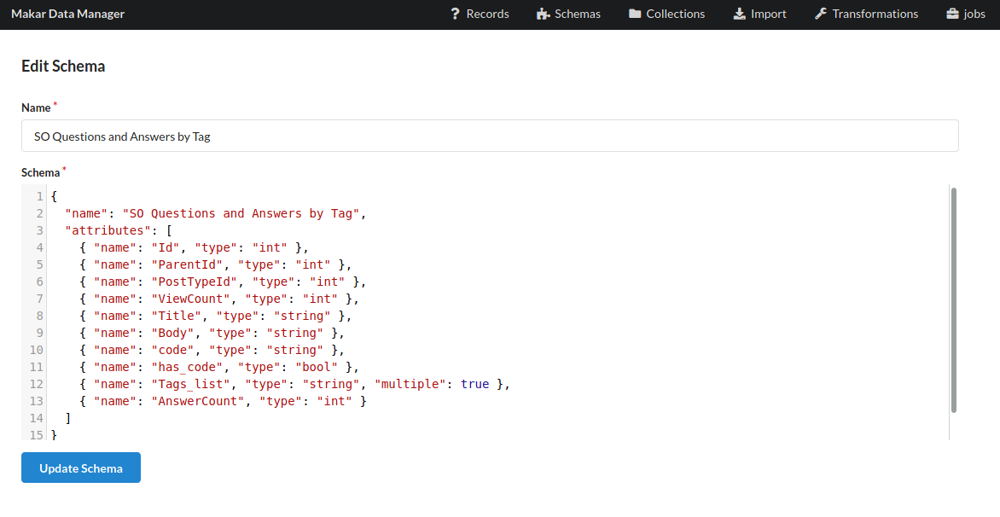
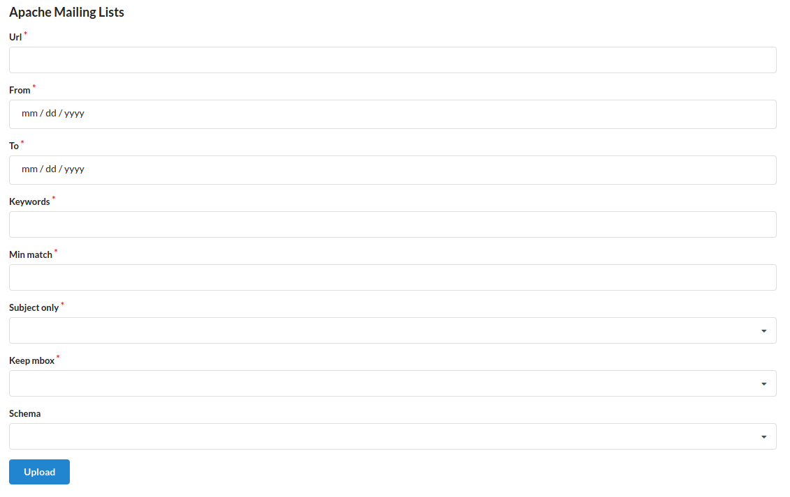
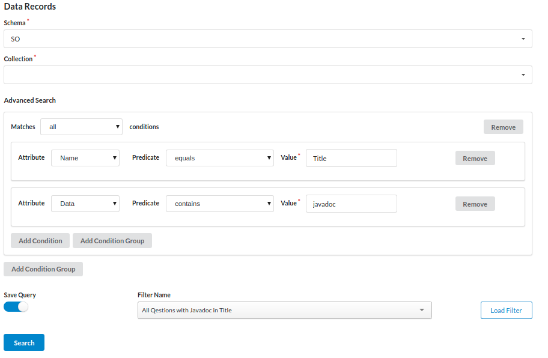
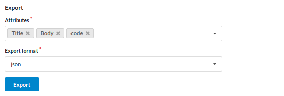

# Makar Data Manager

Makar Data Manager allows to easily import data from different sources (e.g Stack Overflow, Github, Mailinglists). 
User-Defined data models guarantee great flexibility, and with extendable Transformations the data can be preprocessed as needed for further analysis.

## Overview

[1. Requirements](#requirements)<br />
[2. Installation](#installation)<br />
[3. Usage](#usage)<br />
[4. Development](#development)<br />
[5. References](#references)<br />
[6. License](#license)

## Requirements

- Docker (>= v19.03)
- docker-compose (>= v3)

## Installation

1. Set environment variables in `.env` file in the project root

```.env
DATABASE_USER=postgres
DATABASE_PASSWORD=[choose a password]
DATABASE_HOST=db
```

2. Build and run docker containers

```bash
docker-compose build
```

3. Init Database

```bash
docker-compose run --rm web rails db:setup
```

4. Start Makar

```bash
docker-compose up
```

5. Access Makar Data manager at `localhost:3000`

## Usage

### Schema

Schemas define the structure of the datasets managed in Makar.
Go to Menu-Item "Schemas" to manage your schemas.
Schemas can be defined by a special JSON-based DSL.
The following image shows a valid schema definition.
 See `lib/schema_definition.json` for exact specification of how to define a schema.




### Import

Various import adapters are available to load data into Makar.
Some import adapter need to be given an existing Schema (e.g. CSV and JSON import) and the data needs to be exactly matching this schema.
Other import adapters create the Schema ad-hoc.
Based on the import adapter, different parameters need to be given.

Currently implemented import adapters are:

- CSV
- JSON
- Stack Overflow Excerpt API (https://api.stackexchange.com/docs/excerpt-search)
- Apache Mailing Lists
- Github Pull Requests
- Github Issues

Example of the Mailing List Import Adapter:



### Search Interface

All imported records can be browsed and queried on the page "Records".
The search interface allows one to define fine-grained queries with multiple conditions and various search predicates (i.e. contains, equals, less than, ...).
Search queries can be saved as Filters to be reused later.



### Collections

Collections can be created to group records. 
Every record can be part of any number of collections.
Records can be added manually to collections or by assigning a filter (i.e. saved search query) to the collection. When a filter is assigned to a collection, all records matching that filter get assigned automatically to the collection.

Collections offer functionality (e.g. delete records, compact table view, exports, custom exports) that is applied to all records in the collection.

The following image shows an collection which is connected to a filter. By clicking on the sync icon, the collection gets updated with all records matching the assigned filter.


### Transformations

Transformations perform operations on all records of a specified collection.
This is useful to apply preprocessing steps (e.g. remove HTML tags) on the dataset.

The following example show how to remove HTML tags from the attribute "Body" in all records in the Collection "Stack Overflow Questions" and store the result in the attribute "Body_stripped".


A transformation is always executed in a background process. 
The status of such a running transformation can be seen on the page "Jobs".

In case the transformation produces an error, the error log is shown there.


### Export

The datasets in makar can be exported in various formats.
The export functionality is available for collections.
A user can select the attributes to export and specify the format.



## Development

Various parts of this tool can adapted easily to support more use cases, add more transformations, import capabilities or export formats.
The following list should help developers to know where to start looking when extending certain functionality of the tool.

- Import Adapters
    * Extend this class to build your own import adapter: [app/lib/import.rb](app/lib/import.rb)
    * See for an example: [app/lib/import/csv_import.rb](app/lib/import/csv_import.rb)
- Transformations
    * Extend this class to build your own transformations: [app/lib/transformation.rb](app/lib/transformation.rb)
    * See for an example: [app/lib/transformation/strip_html_transformation.rb](app/lib/transformation/strip_html_transformation.rb)
- Custom Exports
    * Extend this class to build your own exports: [app/lib/export.rb](app/lib/export.rb)
    * See for an example: [app/lib/export/mallet_export.rb](app/lib/export/mallet_export.rb)
- Export Formats
    * [app/controllers/collections_controller.rb](app/controllers/collections_controller.rb#L68)
- Schema
    * Schema Definition: [lib/schema_definition.json](lib/schema_definition.json)
    * Model: [app/models/schema.rb](app/models/schema.rb)
    * Record Model: [app/models/record.rb](app/models/record.rb#L124)

## References

- [Ruby](https://www.ruby-lang.org/)
- [Ruby on Rails](https://rubyonrails.org/)
- [Docker](https://www.docker.com/)
- [docker-compose](https://docs.docker.com/compose/)
- [PostgreSQL](https://www.postgresql.org/)

## Demo
- [Youtube](https://youtu.be/Evf5rLJpx9A)

## License

GNU General Public License v3.0 or later

See [COPYING](COPYING) to see the full text.

